# Database Schema (ERD)

**Version**: 1.0.0
**Last Updated**: 2025-12-11
**Related Spec**: [001-service-platform-base](../../specs/001-service-platform-base/spec.md)

## Entity Relationship Diagram

```mermaid
erDiagram
    USER ||--o{ USER_ROLE : has
    ROLE ||--o{ USER_ROLE : assigned_to
    ROLE ||--o{ ROLE_PERMISSION : has
    PERMISSION ||--o{ ROLE_PERMISSION : assigned_to

    USER ||--o{ POST : writes
    USER ||--o{ ATTACHMENT : uploads

    MENU ||--o{ MENU : has_children
    MENU ||--o{ MENU_PERMISSION : has
    ROLE ||--o{ MENU_PERMISSION : can_access

    BOARD ||--o{ POST : contains
    BOARD ||--o{ BOARD_PERMISSION : has
    ROLE ||--o{ BOARD_PERMISSION : can_access

    POST ||--o{ ATTACHMENT : has

    CATEGORY ||--o{ CATEGORY : has_children

    CODE_GROUP ||--o{ CODE : contains

    SERVICE_MODULE ||--o{ MODULE_MENU : provides

    USER {
        uuid id PK
        string username UK
        string password_hash
        string name
        string email UK
        string status
        timestamp created_at
        timestamp updated_at
        timestamp last_login_at
    }

    ROLE {
        uuid id PK
        string name UK
        string description
        boolean is_system
        timestamp created_at
    }

    USER_ROLE {
        uuid user_id PK,FK
        uuid role_id PK,FK
        timestamp assigned_at
    }

    PERMISSION {
        uuid id PK
        string code UK
        string name
        string description
        string module
    }

    ROLE_PERMISSION {
        uuid role_id PK,FK
        uuid permission_id PK,FK
    }

    MENU {
        uuid id PK
        uuid parent_id FK
        string name
        string path
        string icon
        int sort_order
        boolean is_active
        string link_type
        string link_target
        timestamp created_at
    }

    MENU_PERMISSION {
        uuid menu_id PK,FK
        uuid role_id PK,FK
        string permission_type
    }

    BOARD {
        uuid id PK
        string name UK
        string board_type
        string description
        boolean allow_attachment
        int max_file_size
        boolean is_active
        timestamp created_at
    }

    BOARD_PERMISSION {
        uuid board_id PK,FK
        uuid role_id PK,FK
        boolean can_read
        boolean can_write
        boolean can_delete
    }

    POST {
        uuid id PK
        uuid board_id FK
        uuid author_id FK
        string title
        text content
        int view_count
        boolean is_pinned
        boolean is_deleted
        timestamp created_at
        timestamp updated_at
    }

    ATTACHMENT {
        uuid id PK
        uuid post_id FK
        uuid uploader_id FK
        string original_name
        string stored_name
        string file_path
        bigint file_size
        string mime_type
        timestamp created_at
    }

    CATEGORY {
        uuid id PK
        uuid parent_id FK
        string name
        string code UK
        int sort_order
        int depth
        boolean is_active
        timestamp created_at
    }

    CODE_GROUP {
        uuid id PK
        string code UK
        string name
        string description
        boolean is_system
        timestamp created_at
    }

    CODE {
        uuid id PK
        uuid group_id FK
        string code
        string name
        string value
        int sort_order
        boolean is_active
        timestamp created_at
    }

    SETTING {
        uuid id PK
        string key UK
        string value
        string value_type
        string description
        string category
        timestamp updated_at
        uuid updated_by FK
    }

    SETTING_HISTORY {
        uuid id PK
        uuid setting_id FK
        string old_value
        string new_value
        uuid changed_by FK
        timestamp changed_at
    }

    SERVICE_MODULE {
        uuid id PK
        string name UK
        string version
        string description
        boolean is_active
        json config
        timestamp installed_at
        timestamp updated_at
    }

    MODULE_MENU {
        uuid module_id PK,FK
        uuid menu_id PK,FK
    }

    LAYOUT {
        uuid id PK
        string name UK
        string template_type
        json config
        boolean is_default
        timestamp created_at
    }

    NOTIFICATION {
        uuid id PK
        uuid user_id FK
        string type
        string title
        text content
        boolean is_read
        timestamp created_at
        timestamp read_at
    }
```



## Table Descriptions

### Core Tables

| Table | Description | Module |
|-------|-------------|--------|
| `USER` | System users | Authentication |
| `ROLE` | Permission groups | Authentication |
| `PERMISSION` | Granular permissions | Authentication |
| `MENU` | Navigation structure | Menu Management |
| `BOARD` | Board containers | Board Management |
| `POST` | User content | Board Management |
| `ATTACHMENT` | File attachments | Board Management |

### Supporting Tables

| Table | Description | Module |
|-------|-------------|--------|
| `CATEGORY` | Hierarchical categories | Category Management |
| `CODE_GROUP` / `CODE` | Common codes | Code Management |
| `SETTING` | System configuration | Configuration |
| `LAYOUT` | UI templates | Layout Management |
| `NOTIFICATION` | User notifications | Notification |
| `SERVICE_MODULE` | Extensible modules | Service Extension |

## Indexes

### Performance Indexes

```sql
-- User lookups
CREATE INDEX idx_user_username ON USER(username);
CREATE INDEX idx_user_email ON USER(email);
CREATE INDEX idx_user_status ON USER(status);

-- Menu hierarchy
CREATE INDEX idx_menu_parent ON MENU(parent_id);
CREATE INDEX idx_menu_sort ON MENU(sort_order);

-- Post queries
CREATE INDEX idx_post_board ON POST(board_id, created_at DESC);
CREATE INDEX idx_post_author ON POST(author_id);
CREATE INDEX idx_post_search ON POST(title, content);

-- Category hierarchy
CREATE INDEX idx_category_parent ON CATEGORY(parent_id);
CREATE INDEX idx_category_code ON CATEGORY(code);

-- Settings
CREATE INDEX idx_setting_category ON SETTING(category);
```

## Constraints

### Foreign Key Cascade Rules

| Relationship | ON DELETE | ON UPDATE |
|--------------|-----------|-----------|
| USER_ROLE → USER | CASCADE | CASCADE |
| USER_ROLE → ROLE | CASCADE | CASCADE |
| POST → USER | SET NULL | CASCADE |
| POST → BOARD | CASCADE | CASCADE |
| ATTACHMENT → POST | CASCADE | CASCADE |
| MENU → MENU (parent) | SET NULL | CASCADE |
| CATEGORY → CATEGORY (parent) | SET NULL | CASCADE |

## Notes

- All tables use UUID as primary key for distributed systems compatibility
- Timestamps are stored in UTC
- Soft delete pattern used for POST (is_deleted flag)
- Audit fields (created_at, updated_at) on all tables
